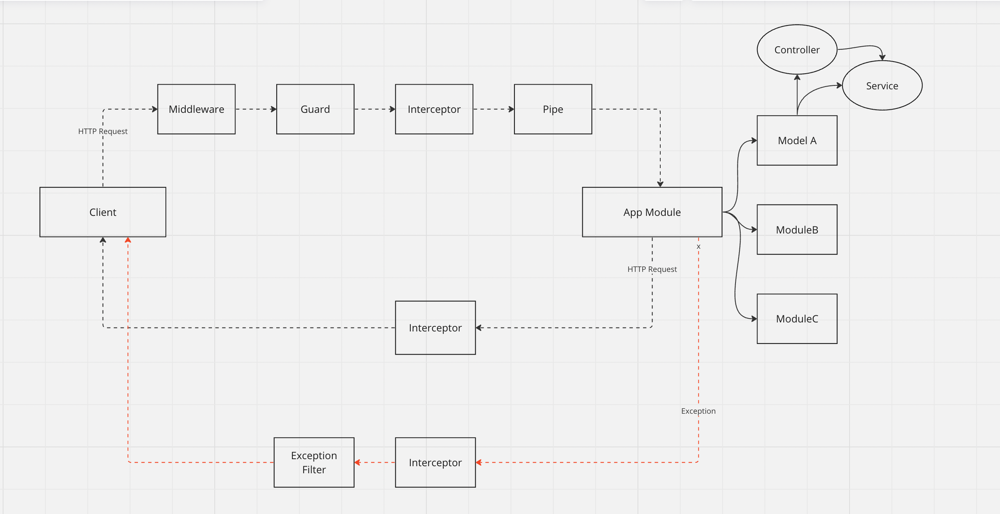
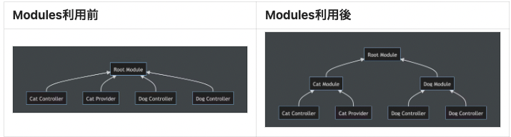

## Nest.jsについて

- TypeScriptで構築された、バックエンド開発のためのNode.jsのフレームワーク

### 特徴

- DIを使用した実装が推奨されている
- CLIが優秀
  nest g resource
- Expressのライブラリを使用できる
- 公式ドキュメントの内容が非常に充実
  - https://docs.nestjs.com/
  - https://zenn.dev/kisihara_c/books/nest-officialdoc-jp/viewer/introduction (日本語版)
- TypeScriptの記述ができる

### 主要ファイル・機能

- イメージ
  

  - App Module(Root Module)にぶら下がる形で他のModuleがある
  - Root Moduleを経由してリクエストは必ず流れる
  - Root Moduleに来る前に幾つかの処理がある
  - Request
    1. Middleware
    2. Guard
    3. Intercepter
    4. Pipe
  - Exception filters, Pipes, Guards, Interceptorsの使い分け
    - Global (グローバルなレベル)
    - Controller (コントローラのレベル)
    - Method (メソッドのレベル)
    - Param (パラメータのレベル、これは後述するように Pipe のみ設定可能)
    - 上記のどのレベルで使いたいかに応じて使い分ける

- controller
  - 形式的には、@Controller() デコレータを適用したクラス
  - エンドポイントの記述
  - リクエストを受けてレスポンスを返す
  - URIの設計
- service(Provider)
  - 形式的には、@Injectable() デコレータを適用したクラスのこと
  - この宣言をした場合、依存対象 (Dependency) として注入 (inject) される
  - リクエストごとの実処理。
  - 業務ロジックにあたる
  - Service を使用するためには、Module へと登録
- module

  - 形式的には、@Module() デコレータを適用したクラスのこと
  - ControllerやProviderをまとめてモジュールという一つの単位にすること
  - @Global() デコレータを適用した Module は、グローバルに利用可能となる
  - @Moduleデコレータ内で定義
  - コントローラやサービスの各クラスを注入(DI)
  - 
  - 構成
    - providers
      - Nest injector によりインスタンス化される Provider で、Module 内でシェア
    - controllers
      - Module で定義される Controller
    - imports
      - Module で使用する Provider をエクスポートしている他の Moduleを宣言
    - export
      - 他のModuleでも使用したいProviderの宣言

- Middleware
  - Route ハンドラの前に呼び出される関数で、リクエストやレスポンスオブジェクトへとアクセス可能
  - クラスと関数で定義ができる(関数が推奨)
  - Middleware を使用するためには、Module において NestModule インターフェースを実装し、 configure() メソッドを定義
  - ローバルに Middleware を登録するためには、use() メソッドを使用
  - 以下のことが可能
    - コードの実行
    - リクエストの改変
    - 他のMiddlewareを呼ぶ
    - リクエスト・レスポンスのサイクルを終わらせる
  - 例
    - ロガーなど
- Exception filters

  - 形式的には、@Catch() デコレータを適用し、ExceptionFilter インターフェース を実装したクラス
  - ハンドルされていない例外を処理する(想定外の)
  - メソッドのレベル、コントローラのレベル、グローバルなレベルで使用
  - Route ハンドラのレベルにおいて使用するためには、次のように @UseFilters() デコレータを使用
  - グローバルに Exception filter を登録するためには、useGlobalFilters() メソッドを使用

- Pipes

  - 形式的には、@Injectable() デコレータを適用し、PipeTransform インターフェースを実装したクラス
  - 使い方
    - 変換: インプットされたデータを変換する (たとえば文字列から整数へ)
    - バリデーション: インプットされたデータに問題がなければ次の処理
  - Joi によるスキーマを使用するバリデーションや、class-validator によるデコレータを使用するバリデーションが推奨
  - メソッドのレベル、コントローラのレベル、グローバルなレベル,パラメータレベルで使える

- Guards

  - 形式的には、@Injectable() デコレータを適用し、CanActivate インターフェースを実装したクラス
  - (権限やロール、ACL 等の) 特定の条件に応じて、リクエストがハンドラによって処理されるべきかどうかを決定(認証)
  - メソッドのレベル、コントローラのレベル、グローバルなレベルで使用

- Interceptors

  - 形式的には、@Injectable() デコレータを適用し、NestInterceptor インターフェースを実装したクラス
  - 以下が可能
    - メソッドの実行の前後において追加のロジックをバインド
    - 関数の返り値を変換
    - 関数から送出された例外を変換
    - 特定の条件に応じて関数をオーバーライド
  -

- DI
  - オブジェクトを生成するクラス/使用するクラスを分けて、生成したオブジェクトを外から注入
  - 依存関係を弱めてテストをしやすく、保守性を上げる
